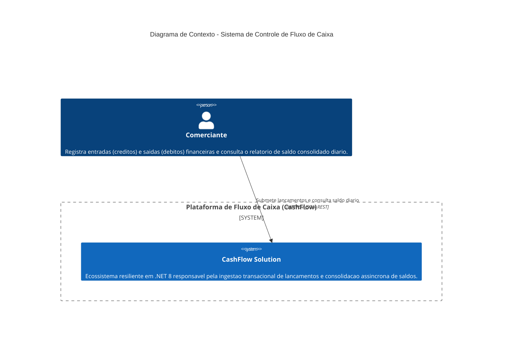
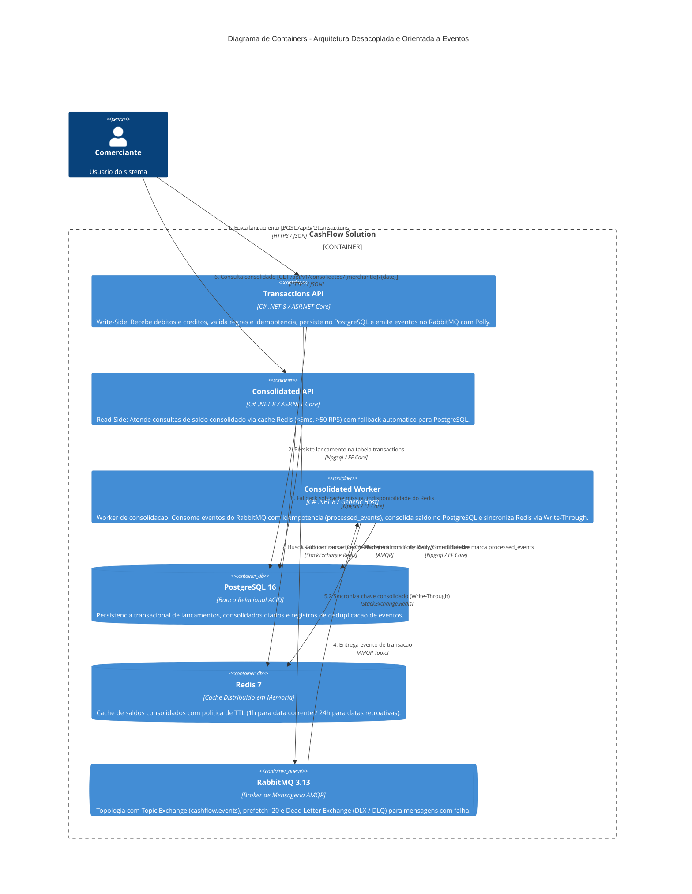

# CashFlow Solution - Controle de Fluxo de Caixa

Arquitetura de microsservicos escalavel, resiliente e de alta disponibilidade desenvolvida em **C# (.NET 8)**, **Clean Architecture**, **CQRS**, **Event-Driven Architecture (RabbitMQ)**, **PostgreSQL** e **Redis**.

---

## 1. Visao Geral e Desenho da Solucao (C4 Model)

O sistema foi concebido para atender o controle de fluxo de caixa diario de comerciantes, segregando estritamente a responsabilidade de escrita (lancamentos de debitos e creditos) da responsabilidade de leitura (consolidado diario apurado).

### 1.1 Diagrama de Contexto (C4 Context)



### 1.2 Diagrama de Containers (C4 Containers)



---

## 2. Decisoes Arquiteturais e Conformidade com o Desafio

| Requisito do Desafio | Decisao Arquitetural Adotada | Justificativa Tecnica |
|---|---|---|
| **Isolamento de Falhas (Lancamentos vs Consolidado)** | Arquitetura Orientada a Eventos (EDA) com RabbitMQ | Se o servico de consolidado diario (ou seu banco/worker) ficar temporariamente indisponivel, o servico de lancamentos continua 100% operacional gravando no PostgreSQL e enfileirando eventos no broker. |
| **Alta Vazao de Leitura (>50 req/s com perda <= 5%)** | Cache Distribuido Redis + Write-Through no Worker | A API de leitura atende consultas diretamente da memoria RAM do Redis com latencia inferior a 5ms, suportando picos de centenas de requisicoes por segundo sem onerar o PostgreSQL. |
| **Resiliencia e Tolerancia a Falhas** | Polly v8 (Retry com Jitter, Circuit Breaker, Timeout, Fallback) | Protege conexoes com o broker, banco e cache. Mensagens nao processaveis sao direcionadas para Dead Letter Queue (DLQ) sem travamento da fila principal. |
| **Padroes e Boas Praticas** | Clean Architecture, DDD, CQRS, SOLID, Factory Methods | Decomposicao clara entre Dominios (Lancamentos e Consolidado), evitando acoplamento e permitindo evolucao independente de cada microsservico. |
| **Idempotencia Estrita** | Chave de idempotencia no Write-Side e deduplicacao no Worker | Evita duplicacao de lancamentos em caso de reenvio por clientes de rede e garante computacao at-least-once sem adulteracao contábil de saldo. |

Documentacao detalhada em Architectural Decision Records:
- [ADR 001 - Padrao CQRS e Mensageria Assincrona](docs/adr/ADR-001-cqrs-event-driven.md)
- [ADR 002 - Estrategia de Cache Distribuido e Fallback](docs/adr/ADR-002-caching-strategy.md)
- [ADR 003 - Tolerancia a Falhas e Resiliencia com Polly](docs/adr/ADR-003-resilience-polly.md)

---

## 3. Como Executar a Aplicacao

### Pre-requisitos
- [Docker](https://www.docker.com/) e Docker Compose instalados.
- [.NET 8 SDK](https://dotnet.microsoft.com/download/dotnet/8.0) (opcional, apenas para desenvolvimento local e testes).

### Passo a passo com Docker Compose

1. **Clone o repositorio e inicie todos os containers:**
```bash
docker-compose up --build -d
```

2. **Verifique o status de saude dos servicos:**
```bash
docker-compose ps
```

3. **Portas e Servicos Expostos:**
- **Transactions API:** `http://localhost:5001` (Swagger: `http://localhost:5001/swagger`)
- **Consolidated API:** `http://localhost:5002` (Swagger: `http://localhost:5002/swagger`)
- **RabbitMQ Management UI:** `http://localhost:15672` (Usuario: `guest`, Senha: `guest`)
- **PostgreSQL 16:** `localhost:5432` (Base de Dados: `cashflow_db`, Usuario: `postgres`, Senha: `postgrespassword`)
- **Redis 7:** `localhost:6379`

---

## 4. Execucao dos Testes Automatizados

A solucao contem 140 testes automatizados cobrindo testes unitarios de dominio, testes de manipuladores CQRS, publicacao de eventos com Polly e uma suite completa de testes ponta a ponta (E2E Opaque-Box em 4 Tiers):

```bash
# Executar toda a suite de testes da solucao
dotnet test --logger "console;verbosity=normal"

# Executar testes com relatorio de cobertura
dotnet test /p:CollectCoverage=true /p:CoverletOutputFormat=cobertura
```

---

## 5. Exemplos Praticos de Chamadas de API

### 5.1 Registrar um Credito (Lancamento)
```bash
curl -X POST http://localhost:5001/api/v1/transactions \
  -H "Content-Type: application/json" \
  -H "X-Idempotency-Key: f47ac10b-58cc-4372-a567-0e02b2c3d479" \
  -d '{
    "merchantId": "MERCHANT_001",
    "amount": 250.75,
    "type": "Credit",
    "description": "Venda de mercadorias no balcao"
  }'
```

### 5.2 Registrar um Debito (Lancamento)
```bash
curl -X POST http://localhost:5001/api/v1/transactions \
  -H "Content-Type: application/json" \
  -H "X-Idempotency-Key: a31bc10b-58cc-4372-a567-0e02b2c3d981" \
  -d '{
    "merchantId": "MERCHANT_001",
    "amount": 50.00,
    "type": "Debit",
    "description": "Pagamento de fornecedor de insumos"
  }'
```

### 5.3 Consultar o Consolidado Diario (Atende >50 req/s via Redis)
```bash
curl -X GET "http://localhost:5002/api/v1/consolidated/MERCHANT_001/2026-09-05" \
  -H "Accept: application/json"
```

**Exemplo de Resposta (HTTP 200 OK):**
```json
{
  "merchantId": "MERCHANT_001",
  "date": "2026-09-05",
  "totalCredits": 250.75,
  "totalDebits": 50.00,
  "closingBalance": 200.75,
  "transactionCount": 2,
  "lastUpdatedAt": "2026-09-05T12:00:00Z",
  "cached": true
}
```

---

## 6. Evolucoes Futuras da Arquitetura

O desafio incentiva a apresentacao de propostas sobre como o sistema pode evoluir tecnicamente:

### 6.1 Change Data Capture (CDC) com Debezium & Apache Kafka
- **Objetivo:** Eliminar o problema de gravacao dupla (*Dual-Write*) entre banco relacional e broker de mensageria.
- **Evolucao:** Em vez de a aplicacao persistir no PostgreSQL e publicar no RabbitMQ em duas etapas de rede, a API grava a transacao e insere o evento em uma tabela `outbox_events` na mesma transacao ACID local. O conector **Debezium for PostgreSQL** monitora o Write-Ahead Log (WAL) e transmite os eventos para topicos particionados por `merchant_id` no **Apache Kafka**, assegurando semantica *exactly-once* e ordenacao cronologica garantida por comerciante.

### 6.2 Orquestracao em Kubernetes (K8s) & Autoscaling Baseado em Eventos (KEDA)
- **Deployment e Isolamento:** Separacao de cada microsservico em Pods e Namespaces proprios, com Resource Requests e Limits rigorosos.
- **KEDA (Kubernetes Event-driven Autoscaling):** O `Consolidated Worker` escalara horizontalmente de 1 para dezenas de pods com base no tamanho da fila do broker (*consumer lag*), permitindo absorver picos repentinos sem represamento de mensagens.
- **Horizontal Pod Autoscaler (HPA):** A `Consolidated API` escalara com base em RPS e utilizacao de CPU, garantindo que o tempo de resposta permaneca submilisegundo mesmo sob sobrecarga.

### 6.3 Stack de Observabilidade com Elastic Stack (ELK) e OpenTelemetry
- **Rastreamento Distribuido (Distributed Tracing):** Instrumentacao com OpenTelemetry SDK (.NET 8) propagando W3C TraceContext no cabecalho HTTP e nas propriedades das mensagens AMQP, permitindo acompanhar o ciclo de vida de uma transacao desde a chamada REST ate a consolidacao no Redis.
- **Elasticsearch e Logstash/FluentBit:** Indexacao e busca centralizada de logs estruturados correlacionados por `traceId` e `merchantId`.
- **Kibana e Elastic APM:** Dashboards em tempo real de latencia (p95, p99), throughput e taxas de erro.
- **Prometheus e Grafana:** Coleta de metricas operacionais de Circuit Breaker (Polly), taxas de cache hit/miss no Redis e uso de conexoes no PostgreSQL.
