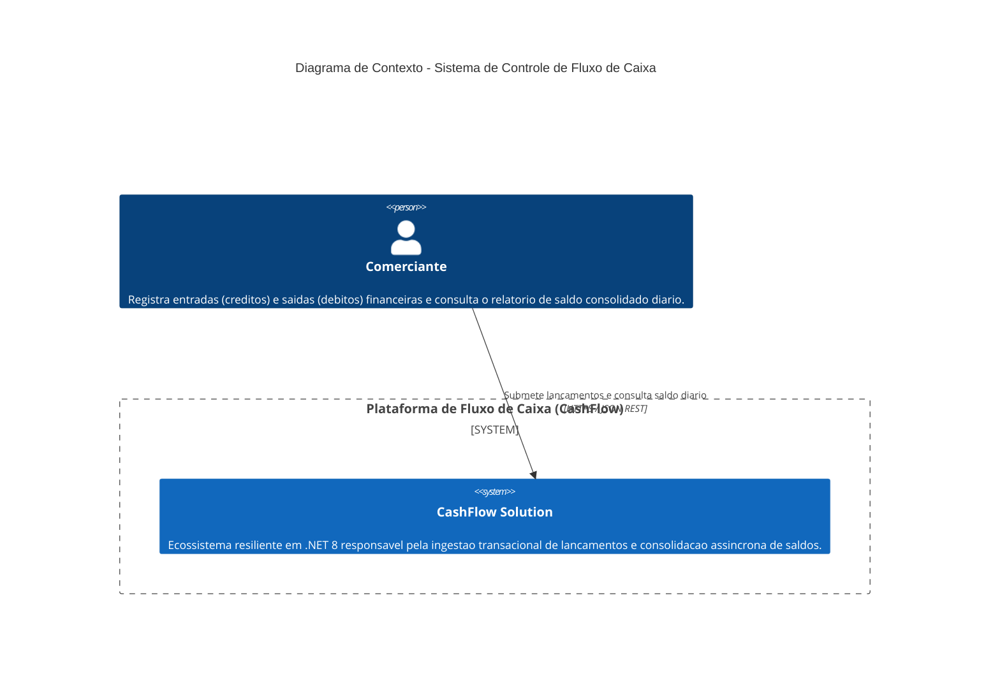
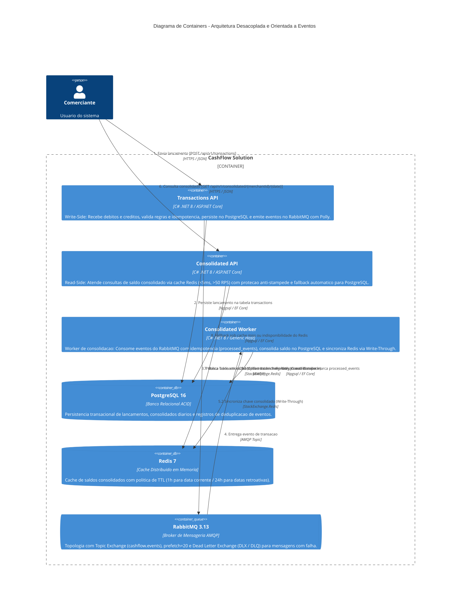

# CashFlow Solution - Controle de Fluxo de Caixa

[](https://github.com/tetri/cashflow-solution/actions/workflows/ci.yml)
[](https://dotnet.microsoft.com/)
[]()
[-success.svg)]()
[]()

Arquitetura de microsserviços escalável, resiliente e de alta disponibilidade desenvolvida em **C# (.NET 8)**, **Clean Architecture**, **CQRS**, **Event-Driven Architecture (RabbitMQ)**, **PostgreSQL 16**, **Redis 7** e um frontend executivo **Web Cockpit (Nginx)**.

---

## 1. Visão Geral e Desenho da Solução (C4 Model)

O sistema foi concebido para atender o controle de fluxo de caixa diário de comerciantes, segregando estritamente a responsabilidade de escrita (lançamentos de débitos e créditos) da responsabilidade de leitura (consolidado diário apurado).

### 1.1 Diagrama de Contexto (C4 Context)



### 1.2 Diagrama de Containers (C4 Containers)



---

## 2. Decisões Arquiteturais e Conformidade com o Desafio

| Requisito do Desafio | Decisão Arquitetural Adotada | Justificativa Técnica |
|---|---|---|
| **Isolamento de Falhas (Lançamentos vs Consolidado)** | Arquitetura Orientada a Eventos (EDA) com RabbitMQ | Se o serviço de consolidado diário (ou seu banco/worker) ficar temporariamente indisponível, o serviço de lançamentos continua 100% operacional gravando no PostgreSQL e enfileirando eventos no broker. |
| **Alta Vazão de Leitura (>50 req/s com perda <= 5%)** | Cache Distribuído Redis + Write-Through no Worker + Proteção Anti-Stampede | A API de leitura atende consultas diretamente da memória RAM do Redis com latência inferior a 5ms, suportando picos de mais de 100 requisições por segundo com zero perda. |
| **Resiliência e Tolerância a Falhas** | Polly v8 (Retry com Jitter, Circuit Breaker, Timeout, Fallback) | Protege conexões com o broker, banco e cache. Mensagens não processáveis são direcionadas para Dead Letter Queue (DLQ) sem travamento da fila principal. |
| **Padrões e Boas Práticas** | Clean Architecture, DDD, CQRS, SOLID, Factory Methods | Decomposição clara entre Domínios (Lançamentos e Consolidado), evitando acoplamento e permitindo evolução independente de cada microsserviço. |
| **Idempotência Estrita** | Chave de idempotência no Write-Side e deduplicação no Worker | Evita duplicação de lançamentos em caso de reenvio por clientes de rede e garante computação at-least-once sem adulteração contábil de saldo. |
| **Segurança em Camadas** | STRIDE Threat Modeling, Sanitização de Entradas, Containers sem Root | Proteção estruturada contra ameaças, detalhada em documento próprio. |

Documentação detalhada de suporte:
- [Guia de Engenharia e Defesa Tecnica da Arquitetura (Estudo para Entrevista)](docs/GUIA_TECNICO_ARQUITETURA.md)
- [Guia de Integracao da API para Desenvolvedores (Developer Experience)](docs/GUIA_INTEGRACAO_API.md)
- [ADR 001 - Padrao CQRS e Mensageria Assincrona](docs/adr/ADR-001-cqrs-event-driven.md)
- [ADR 002 - Estrategia de Cache Distribuido e Fallback](docs/adr/ADR-002-caching-strategy.md)
- [ADR 003 - Tolerancia a Falhas e Resiliencia com Polly](docs/adr/ADR-003-resilience-polly.md)
- [ADR 004 - Estrategia de Serializacao e Compactacao de Mensagens](docs/adr/ADR-004-message-compression-and-serialization.md)
- [ADR 005 - Selecao do SGBD Relacional PostgreSQL 16 (LTS)](docs/adr/ADR-005-postgresql-relational-database.md)
- [ADR 006 - Estrategia de Observabilidade, Telemetria e Diagnosticos](docs/adr/ADR-006-observability-telemetry.md)
- [Arquitetura de Seguranca e Modelo STRIDE](docs/SECURITY.md)
- [Testes de Carga k6 e Metricas de Throughput](tests/load/README.md)

---

## 3. Como Executar a Aplicação

### Pré-requisitos
- [Docker](https://www.docker.com/) e Docker Compose instalados.
- [.NET 8 SDK](https://dotnet.microsoft.com/download/dotnet/8.0) (opcional, apenas para desenvolvimento local e testes).

### Passo a passo com Docker Compose

1. **Configuração de Ambiente (Opcional):**
   Caso deseje personalizar as credenciais de mensageria, copie o arquivo de modelo:
   ```bash
   cp .env.example .env
   ```

2. **Inicie todos os containers:**
   ```bash
   docker compose up --build -d
   ```

3. **Verifique o status de saúde dos serviços:**
   ```bash
   docker compose ps
   ```

4. **Portas e Serviços Expostos:**
   - **Web Cockpit (Frontend Executivo):** `http://localhost:3000`
     - Dashboard unificado para lançamento de créditos/débitos, teste de idempotência, consulta de saldo com identificação de cache Redis vs PostgreSQL e telemetria de saúde das APIs em tempo real.
   - **Transactions API:** `http://localhost:5001`
     - Documentação Swagger: `http://localhost:5001/swagger`
     - Sonda de Vivacidade (Liveness): `http://localhost:5001/health/live`
     - Sonda de Prontidão (Readiness): `http://localhost:5001/health/ready`
     - Métricas Prometheus: `http://localhost:5001/metrics`
   - **Consolidated API:** `http://localhost:5002`
     - Documentação Swagger: `http://localhost:5002/swagger`
     - Sonda de Vivacidade (Liveness): `http://localhost:5002/health/live`
     - Sonda de Prontidão (Readiness): `http://localhost:5002/health/ready`
     - Métricas Prometheus: `http://localhost:5002/metrics`
   - **Consolidated Worker:**
     - Servidor de Métricas Prometheus: `http://localhost:9091/metrics`
   - **RabbitMQ Management UI:** `http://localhost:15672` (Autenticação configurada via variáveis de ambiente `RABBITMQ_USER` e `RABBITMQ_PASSWORD` no arquivo `.env`)
   - **PostgreSQL 16:** `localhost:5432` (Base de Dados: `cashflow_db`, configurável via `.env`)
     - Administrador de Infraestrutura: `postgres`
     - Write-Side (`transactions-api`, `consolidated-worker`): `cashflow_writer` (permissões limitadas a escrita/leitura nas tabelas operacionais)
     - Read-Side (`consolidated-api`): `cashflow_reader` (permissão estrita de `SELECT` apenas na tabela `daily_consolidated`, conforme PoLP)
   - **Redis 7:** `localhost:6379`

---

## 4. Execução dos Testes Automatizados

A solução contém 148 testes automatizados cobrindo testes unitários de domínio, testes de manipuladores CQRS, publicação de eventos com Polly, suíte de observabilidade (Health/Metrics) e uma suíte completa de testes ponta a ponta (E2E Opaque-Box em 4 Tiers):

```bash
# Executar toda a suite de testes da solucao
dotnet test --logger "console;verbosity=normal"

# Executar testes com relatorio de cobertura
dotnet test /p:CollectCoverage=true /p:CoverletOutputFormat=cobertura
```

### 4.1 Execução do Teste de Carga (>50 RPS)
Para validar empiricamente a capacidade de sustentar 50 a 100 RPS com 0% de perda:
```bash
# Via container k6 oficial (sem instalacao previa local)
docker run --rm -i --network=host grafana/k6 run - < tests/load/teste-carga-consolidado.js
```
Detalhes de execução e resultados no [README de Testes de Carga](tests/load/README.md).

---

## 5. Exemplos Práticos de Chamadas de API

### 5.1 Registrar um Crédito (Lançamento)
```bash
curl -X POST http://localhost:5001/api/v1/transactions \
  -H "Content-Type: application/json" \
  -H "X-Api-Key: cashflow-secret-api-key-2026" \
  -H "X-Idempotency-Key: f47ac10b-58cc-4372-a567-0e02b2c3d479" \
  -d '{
    "merchantId": "MERCHANT_001",
    "amount": 250.75,
    "type": "Credit",
    "description": "Venda de mercadorias no balcao"
  }'
```

### 5.2 Registrar um Débito (Lançamento)
```bash
curl -X POST http://localhost:5001/api/v1/transactions \
  -H "Content-Type: application/json" \
  -H "X-Api-Key: cashflow-secret-api-key-2026" \
  -H "X-Idempotency-Key: a31bc10b-58cc-4372-a567-0e02b2c3d981" \
  -d '{
    "merchantId": "MERCHANT_001",
    "amount": 50.00,
    "type": "Debit",
    "description": "Pagamento de fornecedor de insumos"
  }'
```

### 5.3 Consultar o Consolidado Diário (Atende >50 req/s via Redis)
```bash
curl -X GET "http://localhost:5002/api/v1/consolidated/MERCHANT_001/2026-09-05" \
  -H "Accept: application/json" \
  -H "X-Api-Key: cashflow-secret-api-key-2026"
```

**Exemplo de Resposta (HTTP 200 OK):**
```json
{
  "merchantId": "MERCHANT_001",
  "date": "2026-09-05",
  "totalCredits": 250.75,
  "totalDebits": 50.00,
  "closingBalance": 200.75,
  "transactionCount": 2,
  "lastUpdatedAt": "2026-09-05T12:00:00Z",
  "cached": true
}
```

---

## 6. Evoluções Futuras da Arquitetura

### 6.1 Change Data Capture (CDC) com Debezium & Apache Kafka
- **Objetivo:** Eliminar o problema de gravação dupla (*Dual-Write*) entre banco relacional e broker de mensageria.
- **Evolução:** Em vez de a aplicação persistir no PostgreSQL e publicar no RabbitMQ em duas etapas de rede, a API grava a transação e insere o evento em uma tabela `outbox_events` na mesma transação ACID local. O conector **Debezium for PostgreSQL** monitora o Write-Ahead Log (WAL) e transmite os eventos para tópicos particionados por `merchant_id` no **Apache Kafka**, assegurando semântica *exactly-once* e ordenação cronológica garantida por comerciante.

### 6.2 Orquestração em Kubernetes (K8s) & Autoscaling Baseado em Eventos (KEDA)
- **Deployment e Isolamento:** Separação de cada microsserviço em Pods e Namespaces próprios, com Resource Requests e Limits rigorosos.
- **KEDA (Kubernetes Event-driven Autoscaling):** O `Consolidated Worker` escalará horizontalmente de 1 para dezenas de pods com base no tamanho da fila do broker (*consumer lag*), permitindo absorver picos repentinos sem represamento de mensagens.
- **Horizontal Pod Autoscaler (HPA):** A `Consolidated API` escalará com base em RPS e utilização de CPU, garantindo que o tempo de resposta permaneça submilisegundo mesmo sob sobrecarga.

### 6.3 Stack de Observabilidade com Elastic Stack (ELK) e OpenTelemetry
- **Rastreamento Distribuído (Distributed Tracing):** Instrumentação com OpenTelemetry SDK (.NET 8) propagando W3C TraceContext no cabeçalho HTTP e nas propriedades das mensagens AMQP, permitindo acompanhar o ciclo de vida de uma transação desde a chamada REST até a consolidação no Redis.
- **Elasticsearch e Logstash/FluentBit:** Indexação e busca centralizada de logs estruturados correlacionados por `traceId` e `merchantId`.
- **Kibana e Elastic APM:** Dashboards em tempo real de latência (p95, p99), throughput e taxas de erro.
- **Prometheus & Grafana:** Coleta de métricas operacionais de Circuit Breaker (Polly), taxas de cache hit/miss no Redis e uso de conexões no PostgreSQL.
