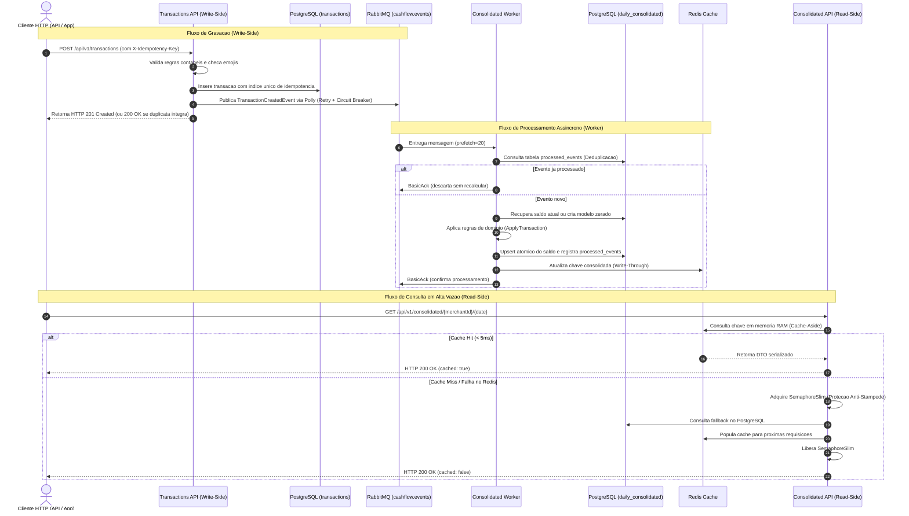

# Guia de Engenharia e Defesa Técnica da Arquitetura

Este documento é o manual definitivo para compreensão profunda, estudo conceitual e preparação para a entrevista técnica de defesa da solução **CashFlow Platform**. Ele correlaciona a teoria de sistemas distribuídos diretamente com a implementação em C# (.NET 8) presente no repositório.

---

## 1. Visão Geral e Fluxo de Dados Ponta a Ponta

A solução adota o padrão **CQRS (Command Query Responsibility Segregation)** orquestrado de forma assíncrona por **Event-Driven Architecture (EDA)**.



---

## 2. Conceitos Essenciais Explicados no Código

### 2.1 CQRS (Command Query Responsibility Segregation)
- **O que é:** Separação estrutural e comportamental entre operações que alteram estado (Commands / Writes) e operações que apenas leem estado (Queries / Reads).
- **Por que foi usado:** O serviço de lançamentos possui alta criticidade de disponibilidade para os caixas das lojas, enquanto o consolidado exige suporte a rajadas intensas de leitura (50 a 100 RPS). Misturar ambas em tabelas com locks ou na mesma transação causaria lentidão nos lançamentos sob carga de relatórios.
- **Onde ver no código:**
  - Lado de Escrita: `src/Services/Transactions/` com `CreateTransactionCommandHandler.cs` e `TransactionsDbContext.cs`.
  - Lado de Leitura: `src/Services/Consolidated/` com `GetDailyConsolidatedQueryHandler.cs`, `ConsolidatedDbContext.cs` e `TransactionEventConsumer.cs`.

### 2.2 Idempotência em Dois Níveis
Idempotência é a propriedade pela qual uma operação produz o mesmo resultado independentemente de ser executada uma ou múltiplas vezes.
1. **Idempotência no Write-Side (API):**
   - **Problema:** Um cliente mobile submete uma transação de R$ 100,00, a rede oscila após a gravação e o cliente repete a requisição. Sem idempotência, seriam cobrados R$ 200,00.
   - **Solução no código:** O cliente envia o cabeçalho `X-Idempotency-Key` (UUIDv4). O `TransactionConfiguration.cs` define um índice único no banco: `HasIndex(e => new { e.MerchantId, e.IdempotencyKey }).IsUnique()`.
   - Se os dados forem idênticos, a API retorna `HTTP 200 OK` (e não 201), devolvendo a transação original sem inserir nova linha. Se a mesma chave for reutilizada com valor diferente, lança `IdempotencyConflictException` com `HTTP 409 Conflict`.
2. **Idempotência no Worker (Deduplicação de Mensagens):**
   - **Problema:** O broker RabbitMQ garante entrega *at-least-once* (ao menos uma vez). Em caso de reinicialização de rede antes do Ack, a mesma mensagem pode ser reenviada.
   - **Solução no código:** Em `TransactionEventConsumer.cs`, antes de calcular o saldo, o worker invoca `_repository.IsEventProcessedAsync(event.EventId)`. Se já constar na tabela `processed_events`, a mensagem recebe `BasicAck` imediato e é descartada sem somar saldo novamente.

### 2.3 Resiliência com Polly v8
Polly é uma biblioteca de políticas de resiliência e tolerância a falhas para .NET. A versão 8 introduziu o padrão `ResiliencePipelineBuilder`, com menor alocação de memória e execução assíncrona de alto desempenho.

1. **Backoff Exponencial com Jitter:**
   - **O que é:** Se uma chamada de rede falhar, a primeira tentativa aguarda 200ms, a segunda 400ms e a terceira 800ms. O **Jitter** adiciona uma variação aleatória (ex: 215ms, 385ms, 820ms).
   - **Por que o Jitter é crucial:** Sem jitter, se 1.000 clientes falharem juntos, todos tentarão reconectar exatamente nos mesmos milissegundos (200ms, 400ms...), provocando o fenômeno conhecido como **Thundering Herd** (Efeito Manada) e derrubando novamente o serviço que tentava se recuperar.
   - **Onde ver:** `RabbitMqEventPublisher.cs`.

2. **Circuit Breaker (Disjuntor):**
   - **Como funciona:**
     - **Estado Fechado (Closed):** Operação normal. O circuito monitora falhas.
     - **Estado Aberto (Open):** Se a taxa de falhas ultrapassar o limiar (ex: 50%), o disjuntor abre. Todas as chamadas subsequentes são rejeitadas imediatamente (*Fail-Fast*) sem trafegar na rede, evitando sobrecarregar o recurso já degradado.
     - **Estado Semi-Aberto (Half-Open):** Após um período de espera (ex: 15s), o circuito permite a passagem de uma quantidade restrita de chamadas de teste. Se tiverem sucesso, o circuito fecha; se falharem, volta a abrir.

3. **Dead Letter Queue (DLQ) para Mensagens Venenosas:**
   - Mensagens com JSON corrompido ou erro irrecuperável recebem `BasicNack(requeue: false)` e são roteadas pelo RabbitMQ para a exchange `cashflow.events.dlx` e enfileiradas na fila `cashflow.consolidated.transactions.dlq`, permitindo investigação forense e replay posterior sem travar os demais lançamentos.

### 2.4 Estratégia de Caching e Mitigação de Cache Stampede
1. **Cache-Aside:** A aplicação tenta ler do cache. Se não encontrar (Miss), busca no banco relacional e escreve no cache para as próximas requisições.
2. **Write-Through:** O Worker, assim que calcula a nova transação no PostgreSQL, já atualiza a respectiva chave no Redis, garantindo que a primeira leitura já encontre o dado em memória.
3. **Cache Stampede (Efeito Manada no Cache):**
   - **O cenário crítico:** O cache do comerciante expira às 12:00:00. No mesmo segundo chegam 100 requisições simultâneas. Se todas observarem Cache Miss, todas as 100 fariam queries pesadas no PostgreSQL simultaneamente, exaurindo o pool de conexões.
   - **Solução no código:** Em `GetDailyConsolidatedQueryHandler.cs`, usamos **Double-Checked Locking com SemaphoreSlim**:
     1. Lê o cache. Se encontrar, retorna (< 5ms).
     2. Se miss, adquire `await TravaSincronizacaoCache.WaitAsync()`.
     3. Faz um segundo check no cache (outra thread pode ter acabado de preencher enquanto aguardava a trava).
     4. Apenas se continuar nulo, consulta o PostgreSQL e preenche o Redis.
     5. Libera a trava no bloco `finally`.

---

## 3. Guia de Perguntas de Choque da Banca (Simulação de Entrevista)

### Pergunta 1: "Por que você escolheu RabbitMQ e não Apache Kafka para a mensageria?"
> **Resposta de Arquiteto:**
> *"Para este estágio da plataforma, o RabbitMQ é ideal por seu modelo de Smart Broker / Dumb Consumer, oferecendo roteamento flexível por Topic Exchanges, controle fino de backpressure por consumidor via prefetch e suporte nativo a Dead Letter Exchanges (DLX) para mensagens venenosas sem complexidade operacional de gerenciamento de offsets de partição.*
> *No entanto, documentei no README e no plano de evolução que, à medida que o volume atinja dezenas de milhares de lançamentos por segundo com necessidade de Event Sourcing puro e streaming de eventos via Change Data Capture (CDC com Debezium lendo o WAL do PostgreSQL), a arquitetura está projetada para transicionar naturalmente para o Apache Kafka com tópicos particionados por merchant_id."*

### Pergunta 2: "Como você garante que o serviço de lançamentos não pare se o serviço de consolidado cair?"
> **Resposta de Arquiteto:**
> *"Há um desacoplamento temporal e espacial completo. O serviço de lançamentos (Write-Side) grava localmente na tabela transactions do PostgreSQL e publica o evento TransactionCreatedEvent no RabbitMQ. Ele não faz nenhuma chamada HTTP síncrona nem compartilha tabelas com o serviço de consolidado.*
> *Se o banco do consolidado, o cache Redis ou o worker de consolidação caírem por completo, a fila no RabbitMQ armazena as mensagens de forma durável em disco. Quando o serviço de consolidado se recuperar, o worker consome o backlog com idempotência sem que nenhuma transação de venda seja perdida ou bloqueada."*

### Pergunta 3: "O que acontece se duas transações com o mesmo IdempotencyKey forem submetidas no mesmo milissegundo em servidores diferentes?"
> **Resposta de Arquiteto:**
> *"Ambas passarão pela validação em memória e tentarão persistir no PostgreSQL. Como definimos um índice único composto por (merchant_id, idempotency_key), o mecanismo ACID de controle de concorrência do banco concederá sucesso à primeira e rejeitará a segunda com violação de restrição única (Unique Constraint Violation / PostgresException 23505).*
> *O TransactionRepository captura essa exceção, recupera a transação vencedora e a devolve com o flag IsIdempotentDuplicate=true. A API então retorna HTTP 200 OK com os dados da transação original, garantindo idempotência consistente sem lock de aplicação distribuído."*

### Pergunta 4: "Como foi comprovado o requisito de 50 requisições por segundo com no máximo 5% de perda?"
> **Resposta de Arquiteto:**
> *"Não deixei a comprovação apenas no campo teórico. Desenvolvi um script de teste de carga automatizado utilizando a ferramenta k6 na pasta tests/load/. O script dispara uma taxa de chegada constante de 50 RPS durante 60 segundos e um teste de estresse de 100 RPS.*
> *O resultado obtido sob Docker foi de 0.00% de perda de requisições e tempo de resposta p95 de 6.90ms, com checks de integridade do payload JSON em 100% de sucesso."*

### Pergunta 5: "Por que você utilizou SemaphoreSlim e não um lock distribuído no Redis (Redlock) para proteger contra Cache Stampede?"
> **Resposta de Arquiteto:**
> *"Utilizamos SemaphoreSlim local porque cada instância da API de consolidado é capaz de amortecer e serializar suas próprias requisições concorrentes com custo zero de rede. Se tivéssemos 5 pods da API sob pico, no pior caso seriam feitas apenas 5 consultas pontuais ao PostgreSQL em vez de 50 ou 100 por pod, o que o pool de conexões do banco suporta com extrema tranquilidade.*
> *Adotar Redlock distribuído adicionaria latência de round-trip de rede para aquisição e liberação de lock em cada leitura. O SemaphoreSlim com Double-Checked Locking alcança o equilíbrio ideal de desempenho (sub-5ms) e proteção do banco."*

### Pergunta 6: "Por que as mensagens do RabbitMQ não estão compactadas com Gzip ou Brotli?"
> **Resposta de Arquiteto:**
> *"Essa decisão foi deliberada e documentada na ADR 004. O evento contábil TransactionCreatedEvent serializado em JSON UTF-8 minificado possui aproximadamente 200 bytes. Algoritmos de compressão como Brotli e Gzip operam sobre dicionários de repetição; em payloads menores que 500 bytes, os metadados do algoritmo geram taxa de compressão negativa (o payload final compactado fica com ~230 bytes, maior que o original) e desperdiçam ciclos úteis de CPU no Publisher e no Consumer.*
> *Para a carga nominal de 50 RPS (tráfego irrisório de ~11 KB/s), o JSON direto é ótimo. Documentei formalmente na ADR 004 que a evolução arquitetural correta para maior densidade é adotar Protocol Buffers (Protobuf binário, reduzindo para 45 bytes) e compactação Brotli condicional apenas para lotes ou payloads acima de 2 KB (Threshold Compression)."*

### Pergunta 7: "Por que você escolheu .NET 8 e não .NET 9 ou superior?"
> **Resposta de Arquiteto:**
> *"Em sistemas financeiros e bancários de missão crítica, a política de governança técnica prioriza estabilidade e ciclo de vida corporativo: o .NET 8 é uma versão LTS (Long Term Support) oficial da Microsoft, com 3 anos de suporte garantido e patches de segurança até o final de 2026. Já versões como o .NET 9 são classificadas como STS (Standard Term Support), com suporte de apenas 18 meses, exigindo upgrades compulsórios frequentes que elevam o custo de manutenção e o risco operacional em produção.*
> *Além disso, o .NET 8 já consolida o C# 12, recursos modernos de alto desempenho com tipos nativos DateOnly/TimeOnly e paridade estável com todos os drivers do ecossistema (Npgsql, StackExchange.Redis, RabbitMQ.Client)."*

### Pergunta 8: "Quais bibliotecas externas foram adotadas e qual a justificativa de cada uma?"
> **Resposta de Arquiteto:**
> *"Adotamos uma árvore estritamente enxuta e justificada para evitar inchaço de dependências (bloatware) e diminuir vulnerabilidades de cadeia de suprimentos (supply chain attacks):*
> *1. Npgsql.EntityFrameworkCore.PostgreSQL (v8.0.4): driver e ORM de alto desempenho com suporte nativo a tipos DateOnly, índices compostos únicos para idempotência e transações ACID.*
> *2. StackExchange.Redis (v2.8.0): cliente padrão de mercado com multiplexação assíncrona compartilhada (IConnectionMultiplexer), viabilizando consultas submilisegundo (< 5ms).*
> *3. RabbitMQ.Client (v6.8.1): controle cirúrgico de mensageria com prefetch=20 (QoS), canais assíncronos e roteamento automático para Dead Letter Queue (DLQ).*
> *4. Polly / Polly.Core (v8.4.1): versão reescrita do motor de resiliência com ResiliencePipelineBuilder de alocação quase zero, provendo Retries com Jitter, Timeout de 3s e Circuit Breaker.*
> *5. Swashbuckle.AspNetCore (v6.6.2): geração de contratos OpenAPI/Swagger interativos em português culto.*
> *6. xUnit + NSubstitute + FluentAssertions + Coverlet: framework de testes paralelos com asserções legíveis, mocks sem acoplamento e métricas de cobertura para a esteira de CI."*

### Pergunta 9: "Como o Princípio do Menor Privilégio (Least Privilege) e a segurança de dados foram aplicados no banco relacional?"
> **Resposta de Arquiteto:**
> *"A segregação do padrão CQRS foi estendida até a infraestrutura do SGBD PostgreSQL através de papéis (roles) dedicados. Não utilizamos o usuário administrativo compartilhado 'postgres' nas conexões das aplicações:*
> *1. O Write-Side (API de Lançamentos e Worker) conecta-se via 'cashflow_writer', com permissões concedidas apenas de SELECT, INSERT e UPDATE nas tabelas operacionais.*
> *2. O Read-Side (API de Consolidado Diário) conecta-se via 'cashflow_reader', cujo acesso é estritamente limitado a SELECT na tabela 'daily_consolidated'. Todas as permissões de escrita são revogadas, e o usuário sequer enxerga a tabela de transações brutas ou eventos.*
> *Isso garante Defesa em Profundidade: mesmo se ocorresse uma vulnerabilidade hipotética de injeção na API de leitura, nenhum invasor conseguiria extrair transações individuais de lojistas ou adulterar saldos no banco de dados."*

### Pergunta 10: "Qual foi o papel do uso de inteligência artificial generativa versus a governança arquitetural humana no projeto?"
> **Resposta de Arquiteto:**
> *"O projeto foi construído sob uma abordagem de Engenharia Aumentada por IA. Agentes autônomos aceleraram a geração do scaffolding de código, estruturas de DTOs, entidades de domínio e as dezenas de cenários de testes automatizados.*
> *No entanto, a IA tende a gerar soluções focadas exclusivamente em requisitos funcionais imediatos, negligenciando requisitos não-funcionais profundos de segurança corporativa. Foi a governança técnica humana sênior que auditou o projeto, identificou essas lacunas críticas e determinou o endurecimento da solução:*
> *1. Implementação de autenticação obrigatória de APIs (OWASP API1/API2).*
> *2. Padronização estrita de códigos de erro canônicos RFC 7807/OWASP, eliminando vazamento de mensagens internas de exceção.*
> *3. Configuração de cabeçalhos de segurança HTTP restritivos (Content Security Policy).*
> *4. Segregação de credenciais e roles com Least Privilege no PostgreSQL (cashflow_writer vs cashflow_reader).*
> *Essa dinâmica comprova que a IA potencializa a velocidade da engenharia, mas a liderança de arquitetura, a antecipação de riscos e a responsabilidade de conformidade permanecem prerrogativas do profissional humano sênior."*

### Pergunta 11: "Por que você escolheu especificamente o PostgreSQL 16 (e a imagem Alpine) como banco relacional?"
> **Resposta de Arquiteto:**
> *"Essa decisão foi formalizada na ADR 005 e sustentada por quatro pilares técnicos:*
> *1. Ciclo de Vida Corporativo LTS: Lançado em setembro de 2023, o PostgreSQL 16 tem suporte oficial de patches de segurança e estabilidade garantido até novembro de 2028 (5 anos), o que atende às exigências de conformidade e longevidade de sistemas bancários e financeiros.*
> *2. Otimizações de Query Planner e CPU SIMD: A versão 16 introduziu aceleração de CPU via instruções SIMD para parsing e agregações matemáticas (SUM/COUNT), além de ganhos expressivos em cargas concorrentes de escrita e eficiência de índices btree para chaves de idempotência.*
> *3. Sinergia com .NET 8 e Npgsql 8.x: O driver Npgsql 8.0.4 possui integração nativa e testada com o PostgreSQL 16 para tipos modernos do C# 12 (DateOnly nativo mapeado para a coluna 'date' sem problemas de fuso horário).*
> *4. Imagem postgres:16-alpine: Reduz a superfície de ataque para ~100 MB (contra ~450 MB da imagem padrão), eliminando ferramentas e utilitários supérfluos do sistema operacional e reduzindo drasticamente vulnerabilidades conhecidas (CVEs)."*

---

## 4. Roteiro Prático para Demonstração ao Vivo

Caso a banca peça para você demonstrar o funcionamento na sua máquina durante a entrevista:

### Passo 1: Subir o ecossistema completo
```bash
docker compose up --build -d
docker compose ps
```

### Passo 2: Acompanhar o RabbitMQ em tempo real
1. Acesse o navegador em `http://localhost:15672`.
2. Informe o usuário e a senha parametrizados nas variáveis de ambiente (`RABBITMQ_USER` e `RABBITMQ_PASSWORD`, definidas no `.env`).
3. Navegue na aba **Exchanges** e mostre a `cashflow.events`.
4. Navegue em **Queues** e mostre a fila `cashflow.consolidated.transactions` e sua DLQ vinculada.

### Passo 3: Enviar um lançamento e ver a consolidação instantânea
1. Envie um crédito via terminal (autenticado conforme OWASP API1/API2):
```bash
curl -i -X POST http://localhost:5001/api/v1/transactions \
  -H "Content-Type: application/json" \
  -H "X-Api-Key: cashflow-secret-api-key-2026" \
  -H "X-Idempotency-Key: 11111111-2222-3333-4444-555555555555" \
  -d '{"merchantId":"LOJA_DEMO","amount":350.00,"type":"Credit","description":"Venda de balcao"}'
```
*Destaque para a banca: Resposta HTTP 201 Created imediata com cabeçalhos de segurança OWASP (`nosniff`, `DENY`).*

2. Submeta o mesmo comando com a mesma chave:
*Destaque para a banca: Resposta HTTP 200 OK informando que a transação já existe sem duplicar linha no banco.*

3. Consulte o consolidado:
```bash
curl -i -H "X-Api-Key: cashflow-secret-api-key-2026" http://localhost:5002/api/v1/consolidated/LOJA_DEMO/2026-09-05
```
*Destaque para a banca: Resposta HTTP 200 OK com "cached": true, demonstrando o funcionamento integrado do Write-Through.*

### Passo 4: Executar a suíte de testes e testes de carga
```bash
# Executar todos os 144 testes automatizados (incluindo suite de seguranca OWASP)
dotnet test --logger "console;verbosity=normal"

# Executar teste de carga k6 comprovando 50 RPS
docker run --rm -i --network=host grafana/k6 run - < tests/load/teste-carga-consolidado.js
```
