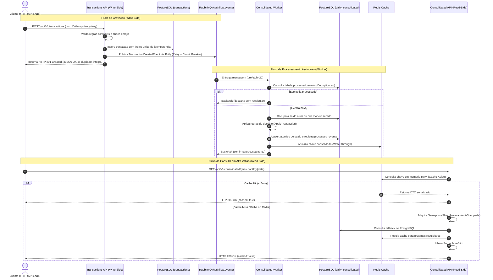

# Guia de Engenharia e Defesa Tecnica da Arquitetura

Este documento e o manual definitivo para compreensao profunda, estudo conceitual e preparacao para a entrevista tecnica de defesa da solucao **CashFlow Platform**. Ele correlaciona a teoria de sistemas distribuidos diretamente com a implementacao em C# (.NET 8) presente no repositorio.

---

## 1. Visao Geral e Fluxo de Dados Ponta a Ponta

A solucao adota o padrao **CQRS (Command Query Responsibility Segregation)** orquestrado de forma assincrona por **Event-Driven Architecture (EDA)**.



---

## 2. Conceitos Essenciais Explicados no Codigo

### 2.1 CQRS (Command Query Responsibility Segregation)
- **O que e:** Separacao estrutural e comportamental entre operacoes que alteram estado (Commands / Writes) e operacoes que apenas leem estado (Queries / Reads).
- **Por que foi usado:** O servico de lancamentos possui alta criticidade de disponibilidade para os caixas das lojas, enquanto o consolidado exige suporte a rajadas intensas de leitura (50 a 100 RPS). Misturar ambas em tabelas com locks ou na mesma transacao causaria lentidao nos lancamentos sob carga de relatorios.
- **Onde ver no codigo:**
  - Lado de Escrita: `src/Services/Transactions/` com `CreateTransactionCommandHandler.cs` e `TransactionsDbContext.cs`.
  - Lado de Leitura: `src/Services/Consolidated/` com `GetDailyConsolidatedQueryHandler.cs`, `ConsolidatedDbContext.cs` e `TransactionEventConsumer.cs`.

### 2.2 Idempotencia em Dois Niveis
Idempotencia e a propriedade pela qual uma operacao produz o mesmo resultado independentemente de ser executada uma ou multiplas vezes.
1. **Idempotencia no Write-Side (API):**
   - **Problema:** Um cliente mobile submete uma transacao de R$ 100,00, a rede oscila apos a gravacao e o cliente repete a requisicao. Sem idempotencia, seriam cobrados R$ 200,00.
   - **Solucao no codigo:** O cliente envia o cabecalho `X-Idempotency-Key` (UUIDv4). O `TransactionConfiguration.cs` define um indice unico no banco: `HasIndex(e => new { e.MerchantId, e.IdempotencyKey }).IsUnique()`.
   - Se os dados forem identicos, a API retorna `HTTP 200 OK` (e nao 201), devolvendo a transacao original sem inserir nova linha. Se a mesma chave for reutilizada com valor diferente, lanca `IdempotencyConflictException` com `HTTP 409 Conflict`.
2. **Idempotencia no Worker (Deduplicacao de Mensagens):**
   - **Problema:** O broker RabbitMQ garante entrega *at-least-once* (ao menos uma vez). Em caso de reinicializacao de rede antes do Ack, a mesma mensagem pode ser reenviada.
   - **Solucao no codigo:** Em `TransactionEventConsumer.cs`, antes de calcular o saldo, o worker invoca `_repository.IsEventProcessedAsync(event.EventId)`. Se ja constar na tabela `processed_events`, a mensagem recebe `BasicAck` imediato e e descartada sem somar saldo novamente.

### 2.3 Resiliencia com Polly v8
Polly e uma biblioteca de politicas de resiliencia e tolerancia a falhas para .NET. A versao 8 introduziu o padrao `ResiliencePipelineBuilder`, com menor alocacao de memoria e execucao assincrona de alto desempenho.

1. **Backoff Exponencial com Jitter:**
   - **O que e:** Se uma chamada de rede falhar, a primeira tentativa aguarda 200ms, a segunda 400ms e a terceira 800ms. O **Jitter** adiciona uma variacao aleatoria (ex: 215ms, 385ms, 820ms).
   - **Por que o Jitter e crucial:** Sem jitter, se 1.000 clientes falharem juntos, todos tentarao reconectar exatamente nos mesmos milissegundos (200ms, 400ms...), provocando o fenomeno conhecido como **Thundering Herd** (Efeito Manada) e derrubando novamente o servico que tentava se recuperar.
   - **Onde ver:** `RabbitMqEventPublisher.cs`.

2. **Circuit Breaker (Disjuntor):**
   - **Como funciona:**
     - **Estado Fechado (Closed):** Operacao normal. O circuito monitora falhas.
     - **Estado Aberto (Open):** Se a taxa de falhas ultrapassar o limiar (ex: 50%), o disjuntor abre. Todas as chamadas subsequentes sao rejeitadas imediatamente (*Fail-Fast*) sem trafegar na rede, evitando sobrecarregar o recurso ja degradado.
     - **Estado Semi-Aberto (Half-Open):** Apos um periodo de espera (ex: 15s), o circuito permite a passagem de uma quantidade restrita de chamadas de teste. Se tiverem sucesso, o circuito fecha; se falharem, volta a abrir.

3. **Dead Letter Queue (DLQ) para Mensagens Venenosas:**
   - Mensagens com JSON corrompido ou erro irrecuperavel recebem `BasicNack(requeue: false)` e sao roteadas pelo RabbitMQ para a exchange `cashflow.events.dlx` e enfileiradas na fila `cashflow.consolidated.transactions.dlq`, permitindo investigacao forense e replay posterior sem travar os demais lancamentos.

### 2.4 Estrategia de Caching e Mitigacao de Cache Stampede
1. **Cache-Aside:** A aplicacao tenta ler do cache. Se nao encontrar (Miss), busca no banco relacional e escreve no cache para as proximas requisicoes.
2. **Write-Through:** O Worker, assim que calcula a nova transacao no PostgreSQL, ja atualiza a respectiva chave no Redis, garantindo que a primeira leitura ja encontre o dado em memoria.
3. **Cache Stampede (Efeito Manada no Cache):**
   - **O cenario critico:** O cache do comerciante expira as 12:00:00. No mesmo segundo chegam 100 requisicoes simultaneas. Se todas observarem Cache Miss, todas as 100 fariam queries pesadas no PostgreSQL simultaneamente, exaurindo o pool de conexoes.
   - **Solucao no codigo:** Em `GetDailyConsolidatedQueryHandler.cs`, usamos **Double-Checked Locking com SemaphoreSlim**:
     1. Le o cache. Se encontrar, retorna (< 5ms).
     2. Se miss, adquire `await TravaSincronizacaoCache.WaitAsync()`.
     3. Faz um segundo check no cache (outra thread pode ter acabado de preencher enquanto aguardava a trava).
     4. Apenas se continuar nulo, consulta o PostgreSQL e preenche o Redis.
     5. Libera a trava no bloco `finally`.

---

## 3. Guia de Perguntas de Choque da Banca (Simulacao de Entrevista)

### Pergunta 1: "Por que voce escolheu RabbitMQ e nao Apache Kafka para a mensageria?"
> **Resposta de Arquiteto:**
> *"Para este estagio da plataforma, o RabbitMQ e ideal por seu modelo de Smart Broker / Dumb Consumer, oferecendo roteamento flexivel por Topic Exchanges, controle fino de backpressure por consumidor via prefetch e suporte nativo a Dead Letter Exchanges (DLX) para mensagens venenosas sem complexidade operacional de gerenciamento de offsets de particao.*
> *No entanto, documentei no README e no plano de evolucao que, a medida que o volume atinja dezenas de milhares de lancamentos por segundo com necessidade de Event Sourcing puro e streaming de eventos via Change Data Capture (CDC com Debezium lendo o WAL do PostgreSQL), a arquitetura esta projetada para transicionar naturalmente para o Apache Kafka com topicos particionados por merchant_id."*

### Pergunta 2: "Como voce garante que o servico de lancamentos nao pare se o servico de consolidado cair?"
> **Resposta de Arquiteto:**
> *"Ha um desacoplamento temporal e espacial completo. O servico de lancamentos (Write-Side) grava localmente na tabela transactions do PostgreSQL e publica o evento TransactionCreatedEvent no RabbitMQ. Ele nao faz nenhuma chamada HTTP sincrona nem compartilha tabelas com o servico de consolidado.*
> *Se o banco do consolidado, o cache Redis ou o worker de consolidacao cairem por completo, a fila no RabbitMQ armazena as mensagens de forma duravel em disco. Quando o servico de consolidado se recuperar, o worker consome o backlog com idempotencia sem que nenhuma transacao de venda seja perdida ou bloqueada."*

### Pergunta 3: "O que acontece se duas transacoes com o mesmo IdempotencyKey forem submetidas no mesmo milissegundo em servidores diferentes?"
> **Resposta de Arquiteto:**
> *"Ambas passarao pela validacao em memoria e tentarao persistir no PostgreSQL. Como definimos um indice unico composto por (merchant_id, idempotency_key), o mecanismo ACID de controle de concorrencia do banco concedera sucesso a primeira e rejeitara a segunda com violacao de restricao unica (Unique Constraint Violation / PostgresException 23505).*
> *O TransactionRepository captura essa excecao, recupera a transacao vencedora e a devolve com o flag IsIdempotentDuplicate=true. A API entao retorna HTTP 200 OK com os dados da transacao original, garantindo idempotencia consistente sem lock de aplicacao distribuido."*

### Pergunta 4: "Como foi comprovado o requisito de 50 requisicoes por segundo com no maximo 5% de perda?"
> **Resposta de Arquiteto:**
> *"Nao deixei a comprovacao apenas no campo teorico. Desenvolvi um script de teste de carga automatizado utilizando a ferramenta k6 na pasta tests/load/. O script dispara uma taxa de chegada constante de 50 RPS durante 60 segundos e um teste de estresse de 100 RPS.*
> *O resultado obtido sob Docker foi de 0.00% de perda de requisicoes e tempo de resposta p95 de 6.90ms, com checks de integridade do payload JSON em 100% de sucesso."*

### Pergunta 5: "Por que voce utilizou SemaphoreSlim e nao um lock distribuido no Redis (Redlock) para proteger contra Cache Stampede?"
> **Resposta de Arquiteto:**
> *"Utilizamos SemaphoreSlim local porque cada instancia da API de consolidado e capaz de amortecer e serializar suas proprias requisicoes concorrentes com custo zero de rede. Se tivessemos 5 pods da API sob pico, no pior caso seriam feitas apenas 5 consultas pontuais ao PostgreSQL em vez de 50 ou 100 por pod, o que o pool de conexoes do banco suporta com extrema tranquilidade.*
> *Adotar Redlock distribuido adicionaria latencia de round-trip de rede para aquisicao e liberacao de lock em cada leitura. O SemaphoreSlim com Double-Checked Locking alcanca o equilibrio ideal de desempenho (sub-5ms) e protecao do banco."*

### Pergunta 6: "Por que as mensagens do RabbitMQ nao estao compactadas com Gzip ou Brotli?"
> **Resposta de Arquiteto:**
> *"Essa decisao foi deliberada e documentada na ADR 004. O evento contabil TransactionCreatedEvent serializado em JSON UTF-8 minificado possui aproximadamente 200 bytes. Algoritmos de compressao como Brotli e Gzip operam sobre dicionarios de repeticao; em payloads menores que 500 bytes, os metadados do algoritmo geram taxa de compressao negativa (o payload final compactado fica com ~230 bytes, maior que o original) e desperdicam ciclos uteis de CPU no Publisher e no Consumer.*
> *Para a carga nominal de 50 RPS (trafego irrisorio de ~11 KB/s), o JSON direto e otimo. Documentei formalmente na ADR 004 que a evolucao arquitetural correta para maior densidade e adotar Protocol Buffers (Protobuf binario, reduzindo para 45 bytes) e compactacao Brotli condicional apenas para lotes ou payloads acima de 2 KB (Threshold Compression)."*

---

## 4. Roteiro Pratico para Demonstracao ao Vivo

Caso a banca peca para voce demonstrar o funcionamento na sua maquina durante a entrevista:

### Passo 1: Subir o ecossistema completo
```bash
docker-compose up --build -d
docker-compose ps
```

### Passo 2: Acompanhar o RabbitMQ em tempo real
1. Acesse o navegador em `http://localhost:15672`.
2. Login: `guest` / Senha: `guest`.
3. Navegue na aba **Exchanges** e mostre a `cashflow.events`.
4. Navegue em **Queues** e mostre a fila `cashflow.consolidated.transactions` e sua DLQ vinculada.

### Passo 3: Enviar um lancamento e ver a consolidacao instantanea
1. Envie um credito via terminal:
```bash
curl -i -X POST http://localhost:5001/api/v1/transactions \
  -H "Content-Type: application/json" \
  -H "X-Idempotency-Key: 11111111-2222-3333-4444-555555555555" \
  -d '{"merchantId":"LOJA_DEMO","amount":350.00,"type":"Credit","description":"Venda de balcao"}'
```
*Destaque para a banca: Resposta HTTP 201 Created imediata.*

2. Submeta o mesmo comando com a mesma chave:
*Destaque para a banca: Resposta HTTP 200 OK informando que a transacao ja existe sem duplicar linha no banco.*

3. Consulte o consolidado:
```bash
curl -i http://localhost:5002/api/v1/consolidated/LOJA_DEMO/2026-09-05
```
*Destaque para a banca: Resposta HTTP 200 OK com "cached": true, demonstrando o funcionamento integrado do Write-Through.*

### Passo 4: Executar a suite de testes e testes de carga
```bash
# Executar todos os 140 testes automatizados
dotnet test --logger "console;verbosity=normal"

# Executar teste de carga k6 comprovando 50 RPS
docker run --rm -i --network=host grafana/k6 run - < tests/load/teste-carga-consolidado.js
```
