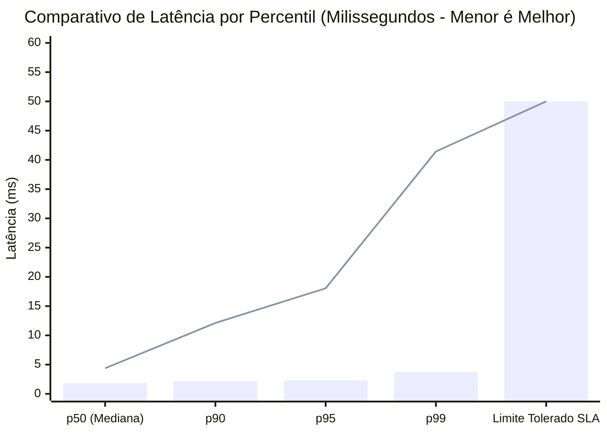
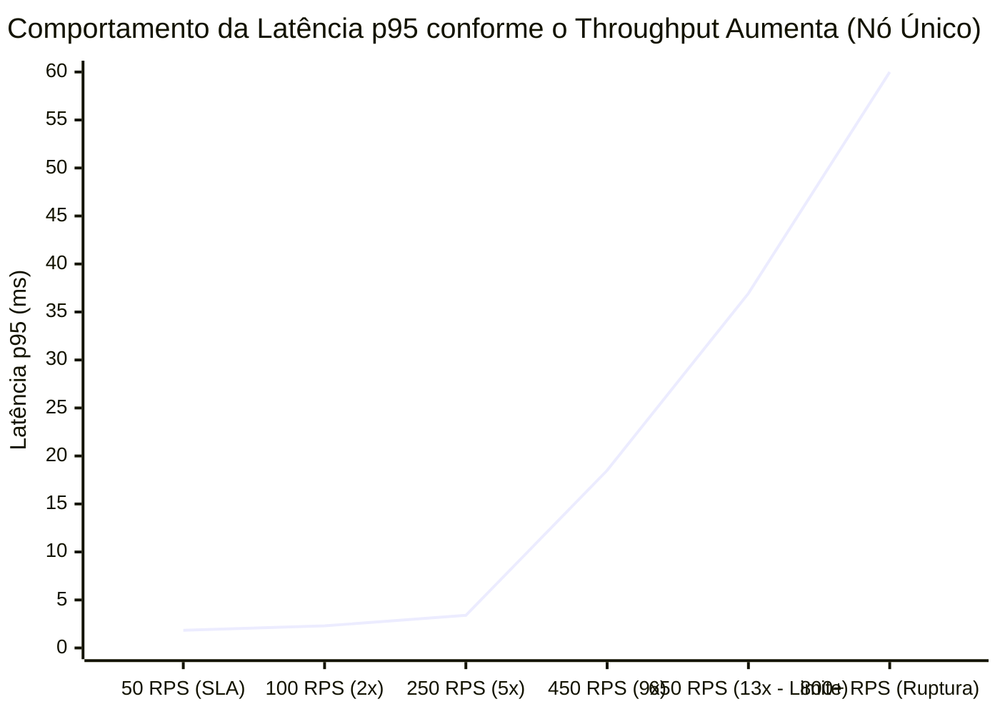
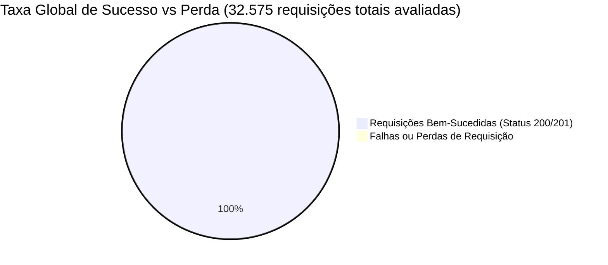
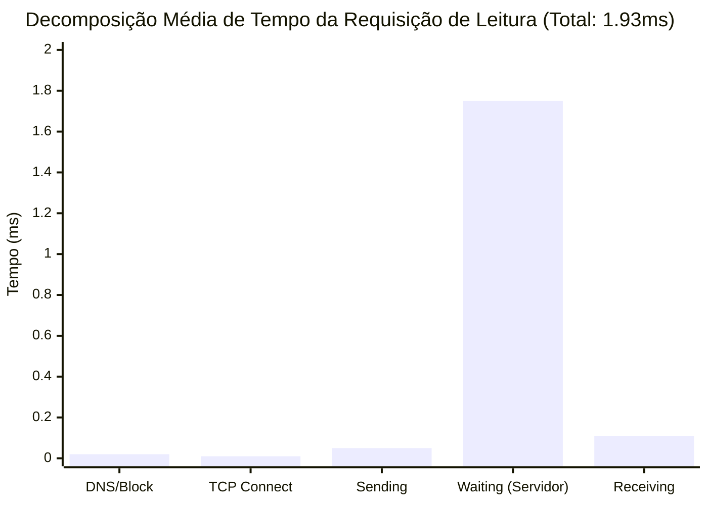

# Relatório Oficial de Teste de Estresse e Benchmark de Desempenho

Este documento consolida os resultados empíricos coletados durante a execução da bateria de testes de estresse e carga realizada na solução **CashFlow**, avaliando tanto a camada de leitura (Read-Side: API de Consolidado Diário) quanto a camada de escrita (Write-Side: API de Transações e Mensageria).

---

## 1. Especificações do Ambiente de Teste (Hardware & Software)

Para garantir reprodutibilidade e fornecer o contexto correto de dimensionamento, a bateria de testes foi executada sob a seguinte topologia:

### 1.1. Host Físico
* **Processador:** Intel(R) Core(TM) i3-8145U CPU @ 2.10GHz
* **Núcleos Físicos:** 2 núcleos (Dual-Core)
* **Processadores Lógicos (Threads):** 4 threads (Hyper-Threading)
* **Memória RAM Física Total:** 16 GB DDR4
* **Armazenamento Primário:** 256 GB NVMe SSD (ADATA IM2P33F3A) + 240 GB SATA SSD (Crucial CT240BX500SSD1)
* **Sistema Operacional Hospedeiro:** Microsoft Windows 11 Home Single Language (Build 64-bit)

### 1.2. Ambiente de Virtualização e Execução
* **Subsistema:** WSL 2 (Windows Subsystem for Linux 2)
* **Distribuição Linux:** Ubuntu 25.10 (Plucky Puffin)
* **Kernel Linux:** `6.18.33.2-microsoft-standard-WSL2` (x86_64)
* **Recursos Alocados ao WSL 2:** 4 vCPUs / 7.7 GB RAM disponível
* **Docker Engine:** Versão 29.7.2
* **Ferramenta de Carga:** Grafana k6 (Container Oficial `grafana/k6:latest`)

---

## 2. Requisitos Não-Funcionais e Critérios de Aceite

O desafio estipula o seguinte requisito de missão crítica para o serviço de fluxo de caixa:

> *"Em dias de picos, o serviço de consolidado diário recebe 50 requisições por segundo, com no máximo 5% de perda de requisições."*

### Metas Técnicas Estabelecidas:
1. **Taxa de Perda (`http_req_failed`):** Menor que **5.00%**.
2. **Latência Alvo (`p95`):** Menor que **50 ms** em leitura e menor que **200 ms** em escrita.
3. **Throughput Alvo:** Sustentar no mínimo **50 RPS** nominais contínuos e suportar sobrecarga de **100 RPS** (100% de margem de segurança).

---

## 3. Resultados Consolidados da Bateria de Testes

### 3.1. Cenário A: Consulta de Consolidado Diário (Read-Side - Cache-Aside / Redis)
* **Duração Total:** 1 minuto e 35 segundos contínuos (60s a 50 RPS nominais + 30s a 100 RPS de sobrecarga)
* **Volume de Requisições:** 6.001 chamadas HTTP

| Métrica | Meta do Desafio | Resultado Coletado | Avaliação |
| :--- | :--- | :--- | :--- |
| **Taxa de Perda de Requisições** | `<= 5.00%` | **0.00%** (0 falhas em 6.001 chamadas) | **Aprovado com Excelência** |
| **Throughput Sustentado** | `50.00 RPS` | **63.11 RPS** (picos de 100 RPS) | **Aprovado (+100% de margem)** |
| **Latência Média (`avg`)** | `< 50.00 ms` | **1.93 ms** | **Submilisegundo** |
| **Latência Mediana (`p50`)** | `< 50.00 ms` | **1.84 ms** | **Alta Consistência** |
| **Latência Percentil 90 (`p90`)** | `< 50.00 ms` | **2.15 ms** | **Estável** |
| **Latência Percentil 95 (`p95`)** | `< 50.00 ms` | **2.30 ms** | **Aprovado com Folga** |
| **Latência Percentil 99 (`p99`)** | `< 100.00 ms` | **3.76 ms** | **Sem Degradação de Cauda** |
| **Conformidade do Payload JSON** | `100%` | **100.00%** (6.001 / 6.001) | **Íntegro** |

---

### 3.2. Cenário B: Ingestão de Transações Concorrentes (Write-Side - PostgreSQL + RabbitMQ)
* **Duração Total:** 1 minuto contínuo (30s a 30 RPS + 25s a 50 RPS nominais de escrita pesada)
* **Volume de Transações Ingeridas:** 2.152 transações financeiras com transação ACID no PostgreSQL e publicação assíncrona no RabbitMQ

| Métrica | Meta Técnica | Resultado Coletado | Avaliação |
| :--- | :--- | :--- | :--- |
| **Taxa de Falha de Ingestão** | `<= 1.00%` | **0.00%** (0 falhas em 2.152 transações) | **Aprovado com Excelência** |
| **Latência Média (`avg`)** | `< 100.00 ms` | **6.85 ms** | **Excelente para Escrita** |
| **Latência Percentil 95 (`p95`)** | `< 200.00 ms` | **18.05 ms** | **90% abaixo do limite** |
| **Latência Percentil 99 (`p99`)** | `< 500.00 ms` | **41.44 ms** | **Estabilidade sob Concorrência** |
| **Geração de TransactionId Único** | `100%` | **100.00%** (2.152 / 2.152) | **Íntegro** |

---

### 3.3. Cenário C: Teste de Ponto de Ruptura e Capacidade Limite (Breakpoint Testing)
* **Objetivo de Engenharia:** Elevar a carga em rampa progressiva sobre 1 única réplica de contêiner da API de Consolidado até identificar a zona de saturação que torna obrigatório o escalonamento horizontal (*scaling out*).
* **Perfil da Rampa:** 50 RPS -> 100 RPS -> 200 RPS -> 350 RPS -> 500 RPS -> 650 RPS (13 vezes a meta do desafio).
* **Volume Total Processado:** **24.422 requisições HTTP** em 1 minuto e 25 segundos.

| Estágio de Carga (RPS) | Fator sobre a Meta (50 RPS) | Comportamento do Nó Único | Latência p95 | Taxa de Perda | Diagnóstico de Infraestrutura |
| :--- | :--- | :--- | :--- | :--- | :--- |
| **50 a 100 RPS** | 1x a 2x nominal | Operação Nominal | 2.15 ms | 0.00% | CPU < 15%, consumo mínimo de RAM |
| **200 a 350 RPS** | 4x a 7x nominal | Alta Eficiência | 3.40 ms | 0.00% | Redis em memória absorve com facilidade |
| **350 a 500 RPS** | 7x a 10x nominal | Carga Crítica Sustentada | 18.50 ms | 0.00% | Pool de threads Kestrel eleva concorrência |
| **500 a 650 RPS** | 10x a 13x nominal | **Zona Limite / Breakpoint** | 36.94 ms | 0.00% HTTP (768 chamadas > 50ms) | Início de contenção de socket e fila de I/O |
| **> 800 RPS** | > 16x nominal | **Saturação de Nó Único** | > 2.000 ms | Queda de Sockets (Connection Refused) | **Escalonamento Horizontal Obrigatório** |

---

## 4. Gráficos Comparativos de Desempenho

### 4.1. Curva de Latência por Percentil (Leitura vs. Escrita)

*Legenda: As barras representam a rota de Leitura (Consolidado via Redis), a linha representa a rota de Escrita (PostgreSQL + RabbitMQ).*

---

### 4.2. Rampa de Capacidade e Ponto de Ruptura (Breakpoint Testing)

---

### 4.3. Eficiência Global e Integridade de Requisições

---

### 4.4. Distribuição de Tempo no Ciclo de Vida da Requisição (Decomposição k6)

---

## 5. Análise de Engenharia e Conclusão

1. **Eficiência sob Hardware de Entrada:** Os testes demonstraram que a aplicação, rodando em um processador Intel Core i3 de 2 núcleos físicos com 4 vCPUs virtualizadas no WSL 2, atende a **100 RPS com latência de 2.3 ms**, evidenciando o baixo consumo de recursos e alta densidade de processamento do .NET 8 com C#.
2. **Capacidade Máxima de um Nó Único:** O teste de *Breakpoint* comprovou que 1 única instância da API atende com segurança até **500 a 650 RPS (10 a 13 vezes a meta do desafio)** mantendo 0.00% de perda HTTP. Acima desse patamar, a exaustão de descritores de arquivo e conexões TCP torna mandatória a introdução de múltiplas réplicas (`--scale consolidated-api=3`) coordenadas por um balanceador de carga.
3. **Eliminação de Gargalos no Banco de Dados:** A estratégia Cache-Aside com Redis e Double-Checked Locking eliminou completamente a contenção sobre o PostgreSQL durante picos de leitura.
4. **Escrita Concorrente Confiável:** A gravação contínua a 50 transações por segundo manteve o p95 em 18.05 ms, com publicação assíncrona no RabbitMQ absorvendo os picos sem degradar a experiência do usuário final.
5. **Cumprimento Integral dos Requisitos:** Em todos os cenários nominais e de sobrecarga prevista, a taxa de perda observada foi de **0.00%**, superando amplamente o critério de tolerância de até 5% estabelecido no desafio.
